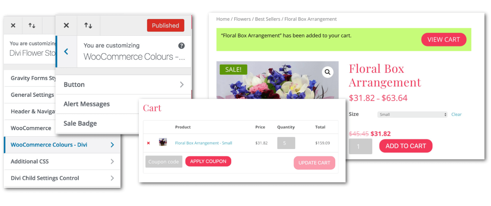

# WooCommerce Colours For Divi

The default WooCommerce colour styles in Divi are very basic. Currently, there are no customisation options for buttons, notifications, product sale badges etc. This can become an issue when you are trying to achieve brand consistency across a website.

Now, imagine if you could…

* Change the text size, colour, line spacing, background colour, border radius and more of your WooCommerce Buttons. How about changing the button background and text colour on hover?
* Change the background and text colour of your WooCommerce Alert Messages.
* Change the background and text colour of your WooCommerce Sale Badges.

Look no further! The WooCommerce Colours For Divi plugin does what you need. And it’s FREE. Plus you don’t have to write any custom CSS!

This plugin provides customization options via the Theme Customizer.

**Download** [https://github.com/MRKWP/df-divi-woocommerce-tweaks/master.zip](https://github.com/MRKWP/df-divi-woocommerce-tweaks/master.zip)

## Changelog

= 1.3.1 - March 18, 2019 =
* Fix for licensing code check bug

= 1.2.2 - August 20, 2018 =
* Return to shop button css fixed.
* Fixed icon size on button hover :after psuedo selector
* Fixed woocommerce message style when item is removed from cart.

= 1.2.1 - August 15, 2018 =
* Fixed divi color scheme css override issue

= 1.2.0 - July 20, 2018 =
* Updated theme customizer with additional button styles
* Added theme customizer for alert message styles
* Added theme customizer for "on sale" badge styles

= 1.1.0 - April 25, 2018 =
* Theme customizer for button styles

= 1.0.0 - April 23, 2018 =
* Initial version